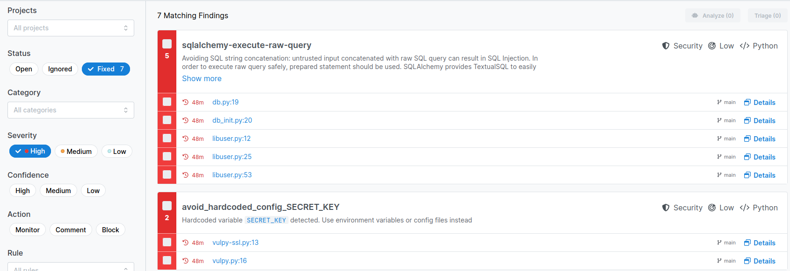
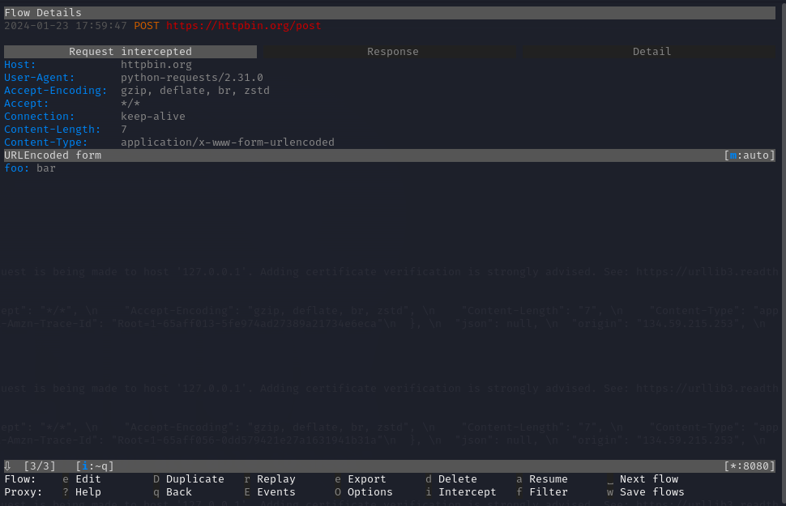
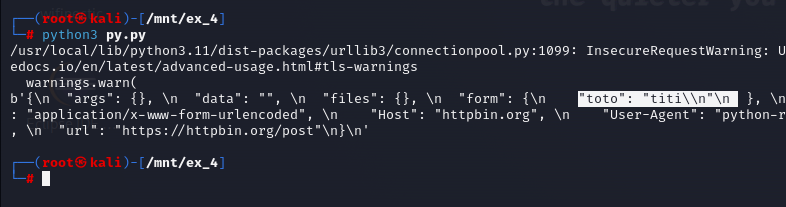

# SI5-CASPAR-ANALYSE-STATIC
## Authors: Robin VIOLLET, Yaël TRAMIER

## Ex1
[Rapport des failles sans config](../SI5-CASPAR-ANALYSE-STATIC/ex_1/report/report_initial.html)

- [Rapport py1](../SI5-CASPAR-ANALYSE-STATIC/ex_1/report/report_py1.html) avec [sa config bandit](../SI5-CASPAR-ANALYSE-STATIC/ex_1/config-bandit/py1.yaml)
- [Rapport py2](../SI5-CASPAR-ANALYSE-STATIC/ex_1/report/report_py2.html) avec [sa config bandit](../SI5-CASPAR-ANALYSE-STATIC/ex_1/config-bandit/py2.yaml)
- [Rapport py3](../SI5-CASPAR-ANALYSE-STATIC/ex_1/report/report_py3.html) avec [sa config bandit](../SI5-CASPAR-ANALYSE-STATIC/ex_1/config-bandit/py3.yaml)
- [Rapport py4](../SI5-CASPAR-ANALYSE-STATIC/ex_1/report/report_py4.html) avec [sa config bandit](../SI5-CASPAR-ANALYSE-STATIC/ex_1/config-bandit/py4.yaml)
- [Rapport py5](../SI5-CASPAR-ANALYSE-STATIC/ex_1/report/report_py5.html) avec [sa config bandit](../SI5-CASPAR-ANALYSE-STATIC/ex_1/config-bandit/py5.yaml)

## Ex2

Here is a list of all the vulnerabilities semgrep found.

- xml-external-entities-unsafe-entity-loader: [test.php:6](https://github.com/PolytechAled/SI5-CASPAR-ANALYSE-STATIC/blame/74f0480cc5a2b874a23bddef74fa46b01280cdc4/ex_2/1/test.php#L6). Possible xxe vulnerability via the dtd data

- xml-external-entities-unsafe-parser-flags: [test.php:11](https://github.com/PolytechAled/SI5-CASPAR-ANALYSE-STATIC/blame/74f0480cc5a2b874a23bddef74fa46b01280cdc4/ex_2/1/test.php#L11). Possible xxe vulnerability via the dtd data

- xml-dtd-allowed: [XmlReader_Tests.cs:19](https://github.com/PolytechAled/SI5-CASPAR-ANALYSE-STATIC/blame/33952a9186ef56dd4ab922f31c67b6a65510d058/ex_2/1/XmlReader_Tests.cs#L19). Possible xxe vulnerability

Now the list is empty as all the reported vulnerabilities have been fixed.

## Ex3

- sqlalchemy-execute-raw-query:
    + [db.py:19](https://github.com/PolytechAled/SI5-CASPAR-ANALYSE-STATIC/blame/872bba4f2654cbd6613e99b9979aa302536e3411/ex_3/db.py#L19). Possible sql injection from user input, fixed by using DB-API’s parameter substitution

    + [db_init.py:20](https://github.com/PolytechAled/SI5-CASPAR-ANALYSE-STATIC/blame/872bba4f2654cbd6613e99b9979aa302536e3411/ex_3/db_init.py#L20). Possible sql injection from user input, fixed by using DB-API’s parameter substitution

    + [libuser.py:12](https://github.com/PolytechAled/SI5-CASPAR-ANALYSE-STATIC/blame/872bba4f2654cbd6613e99b9979aa302536e3411/ex_3/libuser.py#L12). Possible sql injection from user input, fixed by using DB-API’s parameter substitution

    + [libuser.py:25](https://github.com/PolytechAled/SI5-CASPAR-ANALYSE-STATIC/blame/872bba4f2654cbd6613e99b9979aa302536e3411/ex_3/libuser.py#L25). Possible sql injection from user input, fixed by using DB-API’s parameter substitution

    + [libuser.py:53](https://github.com/PolytechAled/SI5-CASPAR-ANALYSE-STATIC/blame/872bba4f2654cbd6613e99b9979aa302536e3411/ex_3/libuser.py#L53). Possible sql injection from user input, fixed by using DB-API’s parameter substitution

- avoid_hardcoded_config_SECRET_KEY:
    + [vulpy.py:16](https:Possible sql injection from user input//github.com/PolytechAled/SI5-CASPAR-ANALYSE-STATIC/blame/872bba4f2654cbd6613e99b9979aa302536e3411/ex_3/vulpy.py#L16). Hardcoded secret key, fixed by storing the key in an environnment variable.

    + [vulpy-ssl.py:13](https://github.com/PolytechAled/SI5-CASPAR-ANALYSE-STATIC/blame/872bba4f2654cbd6613e99b9979aa302536e3411/ex_3/vulpy-ssl.py#L13). Hardcoded secret key, fixed by storing the key in an environnment variable.

Here is a list of all the fixed vulnerabilities, as reported by semgrep.

## Ex4

We have implemented a [simple python app](https://github.com/PolytechAled/SI5-CASPAR-ANALYSE-STATIC/blob/872bba4f2654cbd6613e99b9979aa302536e3411/ex_4/py.py#L7) that makes a request to httpbin.org. httpbin.org is a website to test http requests, it is useful here to check that the request has been intercepted and tampered with as it will send back all received data and the script will print what it receives.

The app has an intended flaw, it does not check that the certificate of the server is valid. Hence it is possible to conduct an MITM attack with a proxy.

The vulnerability is not detected by semgrep.

We used mitmproxy to intercept the request.

We then show the request details.

We are able to change the data.

Then the server sends back the data to the app which prints it.

